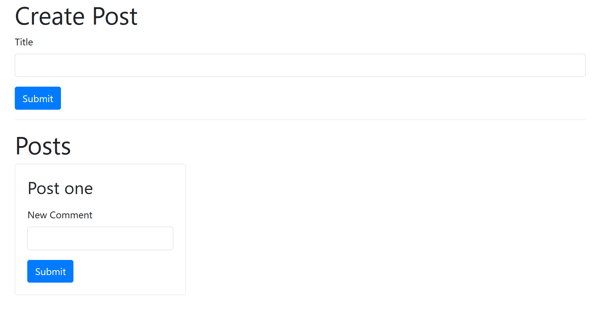
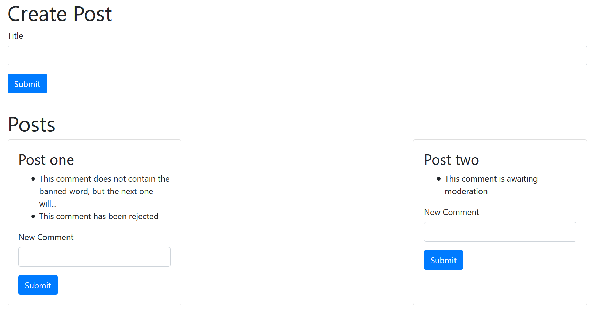

# Microservices Blog App

## Description

Simple app in which a user can create a post (title only!) and then create comments on the post, and have them displayed under the post title.

- Example screenshot:
  

In addition, comments are moderated for use of the word _orange_. Any comment that is created is moderated in the moderation service and either `approved` (when _orange_ is not included) or `rejected` (when _orange_ is included). Until moderation has taken place, the status is `pending`.

Phrase shown to user for each flag:

- `pending`: "This comment is awaiting moderation"
- `rejected`: "This comment has been deleted"
- `approved`: original comment is shown

## Tech stack

- React
- Express
- Nodemon
- Axios
- Cors
- Bootstrap
- Docker

## Project structure

The project currently contains 4 services:

- posts (port 4000)
- comments (port 4001)
- query (port 4002)
- moderation (port 4003)

an event broker:

- event-bus (port 4005)

and a react front end

- client (port 3000)

All posts and comments are held in memory. The browser must be refreshed for posts and comments to appear.

## How it works

### The frontend

On each refresh, the **react frontend** makes a single request to the **query service** and is able to use the data structure that is returned to populate the view with all of the current posts and comments.

### Creating posts

Each time a post is submitted, it is stored in memory by the **post service** and an event of type `PostCreated` is emitted to the **event bus**. Let's say that the post is called _Post one_. The event is picked up by the **event bus** which then sends it back to the service it originated from and to all of the other services. The other services then deal with the event if they are interested in it. In the case of the **query service**, it stores the information about the event in a data structure like this example (no comments on this post have yet been submitted):

```javascript
posts ===
  {
    j123kw: {
      id: "j123kw",
      title: "Post one",
      comments: [],
    },
  };
```

On refresh, the **react frontend** displays the post title in a content box along with a field to write comments and a submit comment button:



### Creating comments

When a comment is submitted, it is stored in memory by the **comment service** and an event is again emitted to the **event bus**. This event is of type `CommentCreated` and has a status of `pending`. The flow of data is more complicated from here on, but works as follows:

- The **event bus** emits the above event and two simultaneous things happen:

<ins>one</ins>

- The **query service** picks it up and stores it in the appropriate post
- The **react frontend** responds to this on refresh, sees the `pending` status and displays the message _This comment is awaiting moderation_

<ins>two</ins>

- The **moderation service** also picks up the event
- If the comment contains the word _orange_, the status is updated to `rejected`. Otherwise the status is updated to `approved`
- The **moderation service** emits a new event, of type `CommentModerated` with this changed information attached to the **event bus**.
- The **event bus** emits the new event
- The **comments service** picks up this event, updates the relevant comment with the new status and emits an event of type `CommentUpdated`, again with the newly updated comment attached, over to the **event bus**
- The **event bus** emits this event
- The **query service**, listening to events of this type, picks it up and updates the comments status appropriately
- The **react frontend**, on refresh, sees the new status and does the appropriate thing. If it is `rejected` _This comment has been rejected_ is displayed. If `approved`, the original comment is displayed

In reality, part two happens so quickly that, unless the moderation service is down or failing for some reason, we would never see the comment in its `pending` state. To force this scenario you can stop only the moderation service and submit a comment. Here are all three states:



The problem with this is that when a service (like the query service) is down, any events that occur during that period are in danger of being missed and therefore lost by the time the service comes back on line. To mitigate for this, the event-bus is also given a datastore, and the broken query service can ask for all of this data when it first comes back online, and finish processing any missed events.

## Docker and Kubernetes

### Intro

Each module (service or frontend) contains a Dockerfile which can be used to create a docker image of that module, which can then be run in a docker container.

Each service and the event-bus has a kubernetes deployment yaml config file to create the infrastructure necessary for each of these parts of the programme to communicate with one another in the ways set out in earlier sections above.

Once the application is up and running, each module will be running once, each in a separate pod and all part of one node, the only node in the cluster.

### Creating docker images and containers

**_Make sure you are signed into your Docker account and running Docker and Kubernetes_**

Clone this repository, navigate into each sub folder in turn in your command line console of choice and run `docker build -t <your-docker-username>/<name-of-the-service> .` to create a docker image for each one. Push these images to your docker hub account: `docker push <your-docker-username>/<name-of-the-service>`.

### Creating a Kubernetes cluster

Navigate to the `blog-app/infra/k8s` directory and run `kubectl apply -f .`. This should create and start up all of the images in separate pods, each with a clusterIp service. Check that all the pods and Kubernetes services are running with `kubectl get pods` and `kubectl get services`.
