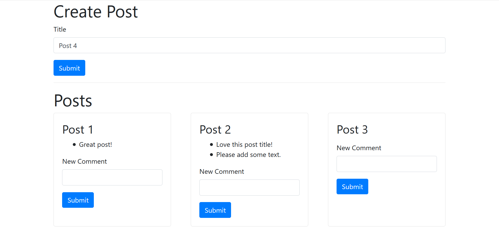

# Microservices Blog App

## Description

Simple app in which a user can create a post (title only!) and then create comments on the post, and display them under the post title.

- Example screenshot:
  

## Project structure

The project contains 2 services:

- posts (port 4000)
- comments (port 4001)

an event broker:

- event-bus (port 4005)

and a react front end

- client (port 3000)

All posts and comments are held in memory. Screen must be refreshed for posts and comments to appear.

## How is works

Each time a post is submitted, it is stored in memory and an event is triggered sending a request to the event bus. The event is picked up by the event bus which then sends it back to the service it originated from and to all the other services.

## Getting started

Clone this repository, navigate into each sub folder in a **separate** command line console and run `npm start`. This will start each element and allow them to communicate with each other as you create and post comments and blog posts.

## Tech stack

- React
- Express
- Nodemon
- Axios
